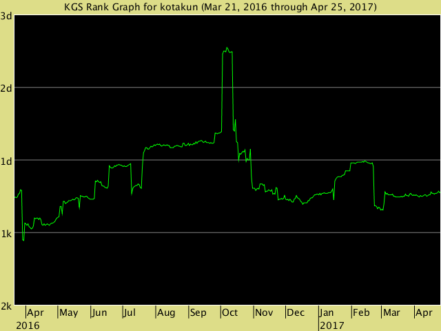
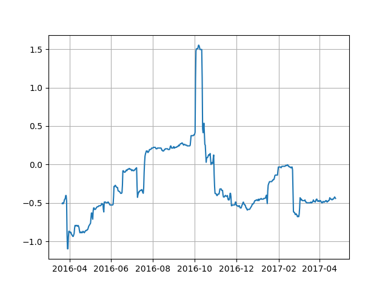

kgschart
================
Kota Mori

`kgschart` package provides a parser for KGS rank graph, which recovers numeric data from the image file. [KGS](http://gokgs.com/) is a free online platform of the [go game](https://en.wikipedia.org/wiki/Go_(game)).



Requirements
------------

-   Python `2.7+` or `3.4+`.
-   `numpy` `pillow` `scipy` `pandas` `scikit-learn` `matplotlib`

Installation
------------

### anaconda/miniconda users

If you use anaconda or miniconda python distribution, install required packages by `conda` command, then install `kgschart`.

``` bash
$ conda install numpy pillow scipy pandas scikit-learn matplotlib pip
$ git clone --depth 1 https://github.com/kota7/kgschart.git
$ pip install --no-deps kgschart
```

### Official (non-conda) Python users

The following command installs `kgschart` along with the dependencies.

``` bash
$ git clone --depth 1 https://github.com/kota7/kgschart.git
$ pip install kgschart
```

Usage
-----

Create `kgschart.KgsChart` class object, which initializes with an image file path. Run the class method `parse` to obtain the numeric data as the `data` attribute.

``` python
>>> from kgschart import KgsChart
>>> k = KgsChart('kotakun-en_US.png')
>>> k.parse()
>>> k.data.head()
                        time      rate
0 2016-03-21 07:46:01.165048 -0.508314
1 2016-03-21 23:18:03.495146 -0.498812
2 2016-03-22 14:50:05.825242 -0.508314
3 2016-03-23 06:22:08.155340 -0.508314
4 2016-03-23 21:54:10.485436 -0.489311
>>> k.plot_data()
```



### Command Line Tool

The `kgschart` package comes with a command line tool, also named as `kgschart`. You can simply pass a KGS id as the argument, then the tool fetches current rank graph from the server and parse it. You can also specify the path to image file as the argument, where you need to flag `-l` or `--local`.

``` bash
$ kgschart kotakun
time   rate
2016-03-21 08:22:01.165048 -0.508313539192399
2016-03-21 23:54:03.495146 -0.4988123515439433
2016-03-22 15:26:05.825242 -0.508313539192399
2016-03-23 06:58:08.155340 -0.508313539192399
2016-03-23 22:30:10.485436 -0.48931116389548723
```

The output is a tab-separated data format of two variables, `time` and `rate`. By default, the result is printed on the console. Use `-o` option to specify the output file. See more options by `kgschart -h`.
